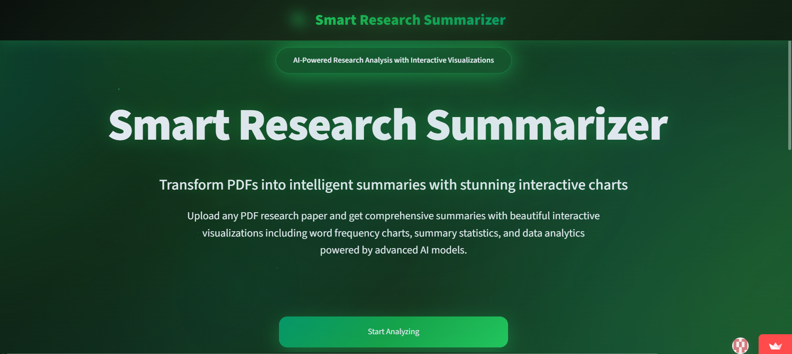
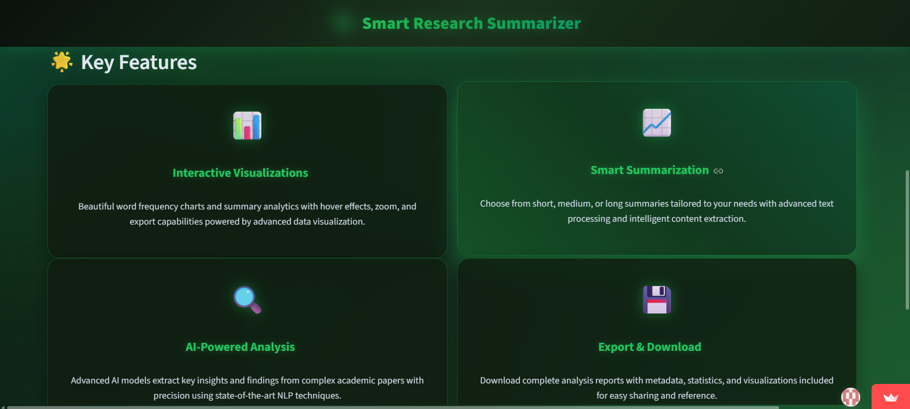
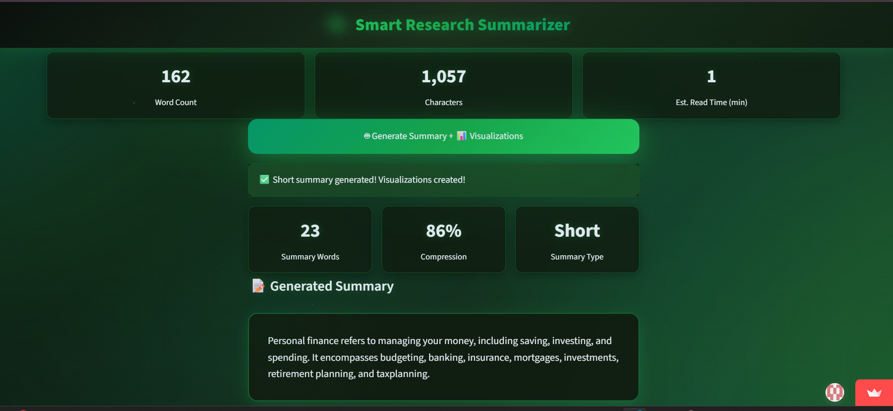
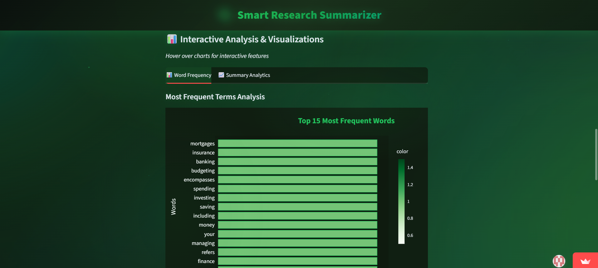
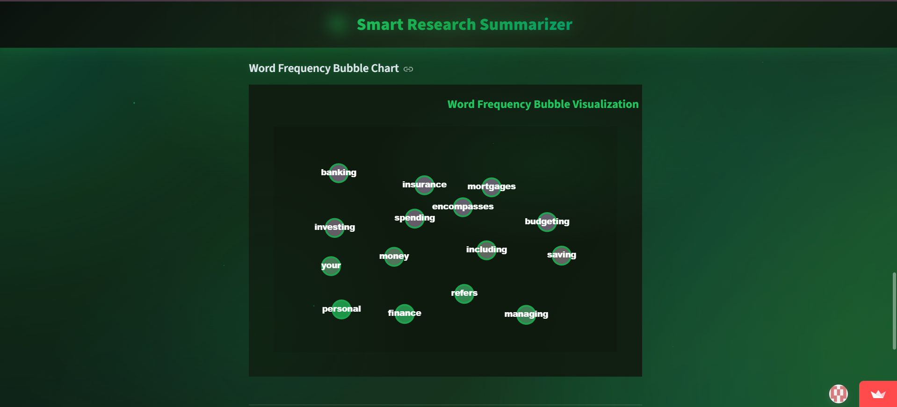

#  Smart Research Summarizer


[](https://smart-researcher.streamlit.app/)

Smart Research Summarizer is an AI-powered tool that helps researchers, students, and professionals quickly generate concise summaries of lengthy research papers. The goal is to save time, improve productivity, and make complex academic content more accessible.

---

## ✨ Features
-  Upload research papers (PDF or text format)
-  Extracts text automatically
-  Generates concise summaries using NLP models
-  Highlights key findings and insights
-  Simple and user-friendly interface

---

##  Screenshots

  
*Application Homepage*

  
*Alternate view of the homepage*

  
*Generated summary example*

  
*Visualization of results*

  
*Another view of the visualization*


---

##  Tech Stack
- **Language:** Python  
- **Libraries:** Hugging Face Transformers, PyPDF2, NLTK  
- **Backend:** Flask / FastAPI  
- **Frontend:** Streamlit or React (depending on your implementation)  
- **Other Tools:** Markdown rendering, PDF parsing  

---

##  Installation and Usage

Clone the repository:

```bash
git clone https://github.com/your-username/smart-research-summarizer.git
cd smart-research-summarizer
```

Install dependencies:

pip install -r requirements.txt


Run the application:

python app.py


Open your browser and navigate to:

http://localhost:5000


## 🧠 How It Works

- User uploads a research paper (PDF or text file).

- The system extracts raw text from the document.

- The NLP model (Transformers) processes the text.

- A concise, structured summary is generated and displayed.

## Alternatively, you can try the deployed app here: https://smart-researcher.streamlit.app/
> ⚠️ Note: The app might "sleep" so if one wants to see the app they'll have to click on the blue button which will "wake the app up" may take a few seconds to load if it hasn't been used recently ("wake up" delay). Please be patient while it starts.
